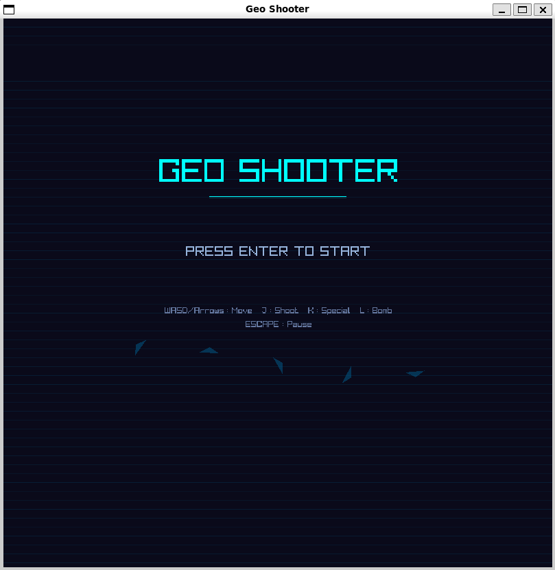
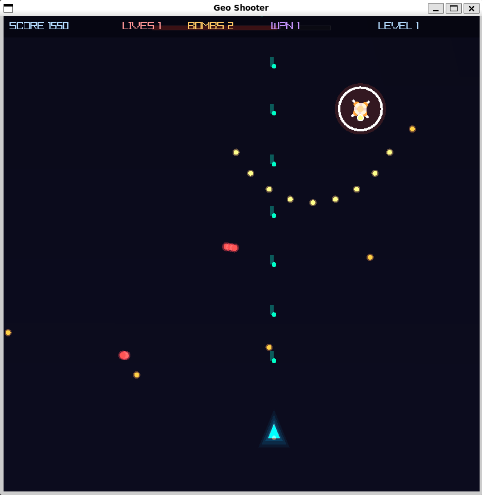
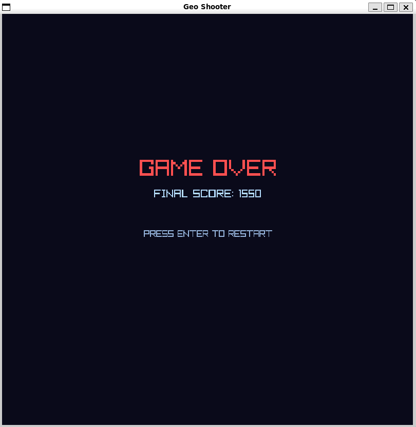

# Geo Shooter

Top-down vertical scrolling shooter built with **Odin** + **Raylib**.







## Controls

| Key | Action |
|-----|--------|
| WASD / Arrows | Move |
| J | Shoot (primary) |
| K | Special spread shot (cooldown) |
| L | Bomb (screen clear) |
| Escape / P | Pause |
| Enter / Space | Start / Continue |

## Features

- **Geometric neon art** — procedural shapes with additive glow blending
- **4 enemy types** — Scout (diamond), Tank (hexagon), Swarm (triangle), Sniper (cross)
- **Boss fights** — rotating pattern attacks (aimed burst, circle spray, fan spread)
- **6 power-ups** — SpeedUp, TripleShot, Shield, Bomb, Heal, WeaponUp (5 levels)
- **GLSL background shader** — scrolling starfield with grid warp
- **Particle FX** — explosions, trails, screen shake
- **HUD** — score, lives, bombs, weapon level, active buffs
- **Progressive difficulty** — infinite levels, escalating enemy spawns

## Build

```sh
odin build . -o:speed -out:geo_shooter
```

Requires Odin dev-2026-05-nightly or later (raylib linked statically from vendor).

## Run

```sh
./geo_shooter
```

Must be run from the project root (shader file paths are relative).

## Adding 3D Models

Replace the procedural draw functions in `render.odin` with `rl.DrawModel()` after loading `.glb`/`.obj` files exported from Blender via `rl.LoadModel()`.
